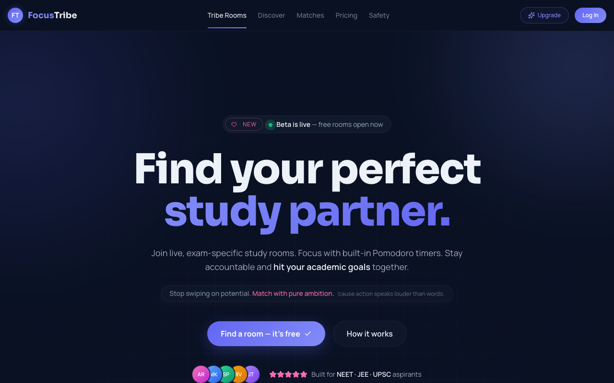
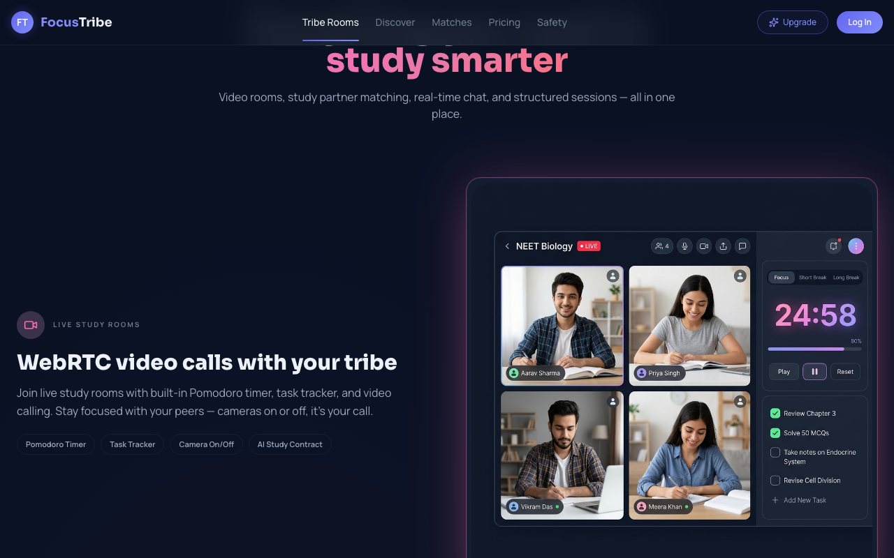
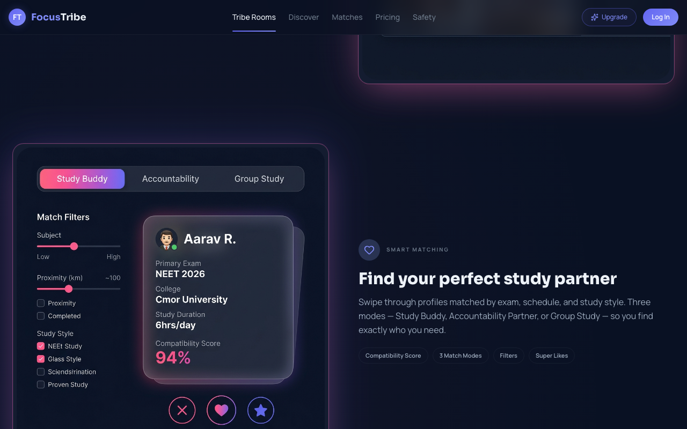
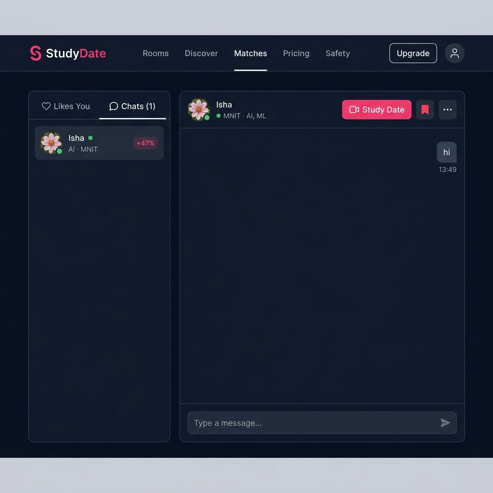
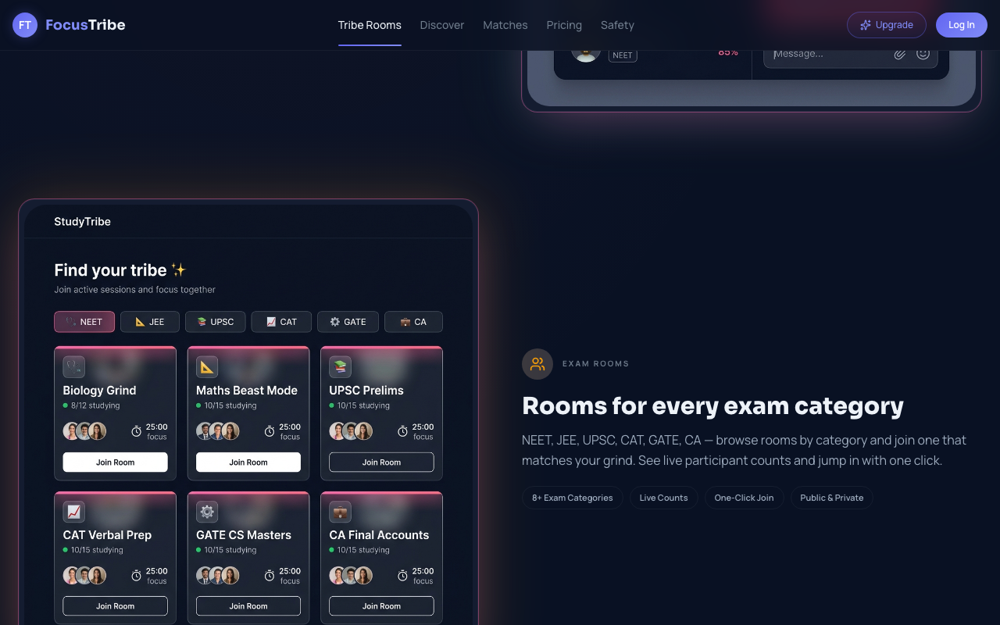
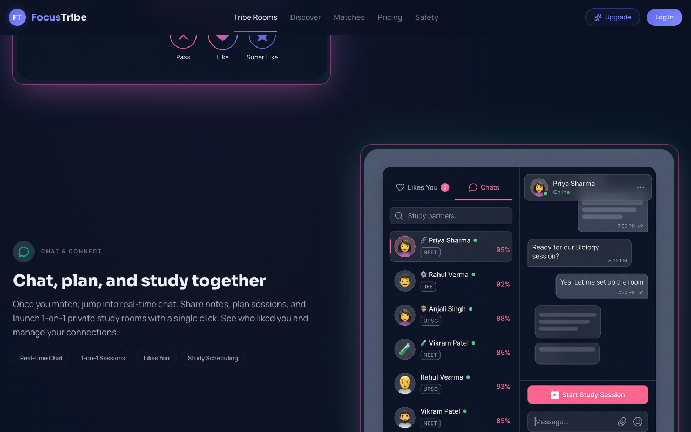

<div align="center">

# FocusTribe 🎯

**AI-powered live study rooms for India's competitive exam aspirants**

NEET · JEE · UPSC · CAT · GATE · CA

[](https://focustribe.focustribe-app.workers.dev/)
[](https://github.com)
[](https://github.com)

> 🔒 **Source code is private** — available on request via [email or LinkedIn](#-contact)

</div>

---

## The Problem

India has **2M+ competitive exam students** who study in isolation with no real accountability. Existing tools either:
- Cap study hours (4hr/day limit = ₹690/mo elsewhere)
- Are generic productivity apps with zero exam context
- Offer no live social layer — no real study partners

FocusTribe fixes all three.

---

## What I Built

A full-stack SaaS platform where students join **live, exam-specific video study rooms** — not just passive timers. It's structured co-working with AI at the core.

---

## ✨ Features

### 🤖 AI Study Contract *(Core AI Feature)*

The flagship feature. When two matched study partners enter a 1-on-1 room:

1. Each user commits their **session goal** before the video room loads (Task Gate)
2. Both goals are sent to **Gemini AI** along with session duration and study mode
3. Gemini generates a **collaborative, milestone-based study plan** — interleaved between both users' objectives
4. The contract is **broadcast in real-time** to the partner via Supabase Realtime Broadcast (zero polling, sub-second delivery)
5. Both partners **check off milestones together** — each toggle syncs to the other user instantly
6. An AI "coach tip" is included, personalized to the combined context

**Three session modes:** Silent (deep focus) · Collaborative (shared tasks) · Quizzing (quiz each other)

```
User A: "Finish organic chemistry chapter 12"
User B: "Revise integration formulas"
Session: 50 min · Mode: Collaborative
              ↓
         Gemini AI
              ↓
┌─────────────────────────────────────────────────┐
│  📜 Tonight's Study Contract                     │
│                                                   │
│  ✅ 0:00–10min  Warm-up: swap hardest topics     │
│  ⬜ 10–25min   Deep focus block (no chat)        │
│  ⬜ 25–30min   Break + share one insight each    │
│  ⬜ 30–45min   Partner accountability check-in   │
│  ⬜ 45–50min   Summarize & plan tomorrow         │
│                                                   │
│  💡 Coach: "Interleaved practice boosts..."      │
└─────────────────────────────────────────────────┘
              ↓ Supabase Realtime Broadcast
         Partner sees it instantly
```

---

### 📹 Live Video Study Rooms (WebRTC)

- **Jitsi Meet** integration — open source, no per-minute billing at scale
- Dynamic room provisioning: `focustribe-{exam}-{roomId}`
- Camera on/off, mic gating (public rooms = muted by default; 1-on-1 = mic enabled)
- Real-time **live participant counts** via Supabase Presence

---

### ⏱️ Pomodoro Timer

- **25 / 5 / 15 min** focus · short break · long break modes
- State persisted to `localStorage` per room — refresh-safe
- Progress bar syncs visually with session goal commitment
- Mobile: floating pill button with slide-up panel

---

### 🎯 Session Task Gate

Users must **write a session goal** before the video room loads. This enforces intentional studying — not passive presence. Goal is auto-added to the task list and synced to the partner.

---

### 💘 Smart Study Partner Matching

- Swipe-style card UI (Tinder-style, but for ambition)
- **Compatibility scoring** based on exam, study schedule, and style
- Three match modes: **Study Buddy · Accountability Partner · Group Study**
- Super Likes for premium users
- Free users see blurred "Likes You" cards (paywall upgrade flow)

---

### 💬 Real-time Chat + 1-on-1 Sessions

- Post-match messaging via Supabase Realtime
- **One-click launch** of a private 1-on-1 video room from chat
- Study session scheduling built into chat flow

---

### 💳 Freemium SaaS

- Free tier: unlimited public rooms, limited matches/actions
- Pro tier: unlimited everything + 1-on-1 rooms + AI contracts
- **DodoPayments** integration (checkout + webhook)
- Referral system: refer a friend → earn 3 days Pro free

---

## 🏗️ System Architecture

```
┌────────────────────────────────────────────────────────────┐
│                   React 19 + TanStack Router                │
│              (File-based routing, type-safe params)         │
└───────────────────────────┬────────────────────────────────┘
                            │
          ┌─────────────────┼──────────────────┐
          ▼                 ▼                  ▼
    Supabase           Jitsi Meet          Gemini AI
  ┌──────────┐       (WebRTC Video)     (Study Contracts)
  │ Auth     │
  │ Postgres │       ┌────────────────────────────────┐
  │ Realtime │◄─────►│  Supabase Realtime Broadcast   │
  │ Presence │       │  • Contract sync               │
  │ Edge Fns │       │  • Goal sync between partners  │
  └──────────┘       │  • Milestone toggle broadcast  │
                     └────────────────────────────────┘
          │
   ┌──────┴──────┐
   │  Cloudflare │  ← Edge deployment, <5ms cold start
   │   Workers   │
   └─────────────┘
```

**Key architectural decisions:**

| Decision | Choice | Why |
|---|---|---|
| Routing | TanStack Router | Full type-safety on params, file-based, SSR-optional |
| Real-time | Supabase Broadcast | Zero-infra pub/sub, no separate WebSocket server |
| Video | Jitsi Meet | Open source, no per-minute cost at scale |
| AI | Gemini API | Best instruction-following for structured JSON output |
| Edge | Cloudflare Workers | <5ms cold start vs ~100ms Lambda |
| Payments | DodoPayments | Better DX for INR subscriptions than Stripe |

---

## 🛠️ Tech Stack

| Layer | Technology |
|---|---|
| **Frontend** | React 19, TypeScript, TanStack Router v1, TanStack Query v5 |
| **Styling** | Tailwind CSS v4, Radix UI primitives, custom design system |
| **Backend / DB** | Supabase (PostgreSQL, Auth, Realtime, Edge Functions) |
| **AI** | Google Gemini API |
| **Video** | Jitsi Meet (WebRTC) |
| **Payments** | DodoPayments |
| **Deployment** | Cloudflare Workers, Vite 7 |
| **PWA** | Service Worker, Web App Manifest |

---

## 📁 Project Structure (High-Level)

```
src/
├── routes/                    # File-based pages (TanStack Router)
│   ├── index.tsx              # Landing + room discovery
│   ├── room.$slug.$id.tsx     # Live study room (Jitsi + Pomodoro + AI)
│   ├── matches.tsx            # Partner matching + chat
│   ├── discover.tsx           # Swipe-to-match UI
│   ├── profile.tsx            # User profile management
│   └── pricing.tsx            # Freemium paywall
├── components/                # Reusable UI components
├── lib/
│   ├── ai.ts                  # Gemini API integration
│   ├── useStudyContract.ts    # AI contract state + Realtime sync
│   ├── useSessionGoalSync.ts  # Goal broadcast between partners
│   ├── rooms.ts               # Room CRUD + presence
│   └── profiles.ts            # Matching logic + compatibility
supabase/
└── functions/                 # Edge Functions (payments, webhooks)
```

---

## 🧠 AI Engineering Highlights

1. **Structured output from Gemini** — contract is returned as typed JSON (`StudyContract`), not free text, so it renders directly into UI components without parsing errors

2. **Real-time AI output delivery** — generated contract is immediately broadcast to the partner via Supabase channel, no page refresh required

3. **Context-aware prompting** — AI receives: both users' goals, session duration, chosen mode (silent/collaborative/quizzing), and generates mode-appropriate milestones

4. **Offline resilience** — contract is cached to `localStorage` so refreshing the room doesn't lose the AI-generated plan

5. **Collaborative delta sync** — each milestone toggle is broadcast as a delta `{id, done}`, not a full state replace, keeping bandwidth minimal and updates instant

---

## 📸 Screenshots

| Landing | Live Study Room |
|---|---|
|  |  |

| Smart Partner Matching | Chat + 1-on-1 Room Launch |
|---|---|
|  |  |

| Exam Rooms Grid | Chat & Connect |
|---|---|
|  |  |

---

## 🚀 Built Solo

Every part of this — from database schema to UI animations to AI integration to payment flows — was designed, built, and shipped by me alone.

**What that involved:**
- Supabase schema design (auth, rooms, profiles, matches, messages)
- Custom real-time state management patterns
- Gemini AI prompt engineering for reliable structured output
- WebRTC room orchestration with Jitsi
- Full freemium SaaS monetization flow
- PWA with service worker and offline handling
- Cloudflare Workers edge deployment

---

## 📬 Contact

Source code and architecture deep-dive available on request.

→ **Email:** riteshimself@gmail.com  
→ **LinkedIn:** linkedin.com/in/ritesh-dhobale/  
→ **Portfolio:** focustribe.focustribe-app.workers.dev

---

<div align="center">

Built with ☕ and way too many Pomodoros.

</div>
